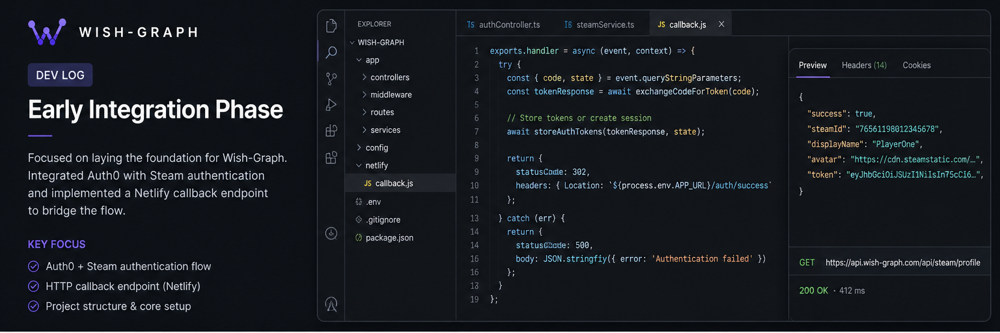

# Wish-Graph Dev Log: Early Integration Phase

[Watch Dev Log Video](https://example.com/devlog-early-integration)

Work during this phase focused on getting the foundation of Wish-Graph into a usable state. The design language and overall theming of the application were finalized, which helped set a clear direction for UI and user experience moving forward. Development tasks were organized through a Trello board, and initial implementation of core features began, including early integration attempts with Steam authentication alongside Auth0.

A major challenge during this period was dealing with Steam’s authentication flow. Steam requires a traditional HTTP callback endpoint rather than supporting direct application-level callbacks, which forced a shift in architecture. To work around this, a Netlify-hosted endpoint was introduced to handle the callback and bridge the authentication flow back into the app. There were also some misunderstandings around how the Steam API behaves, which slowed progress but clarified the correct implementation path.

By the end of this phase, Auth0 and Steam were working together more reliably, and focus began shifting toward wishlist ingestion. While there were still API limitations to work through, the project had moved beyond planning and into real system integration.
