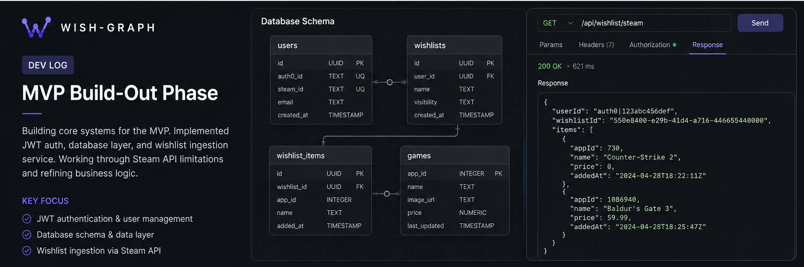

# Wish-Graph Dev Log: MVP Build-Out Phase

[Watch Dev Log Video](https://example.com/devlog-mvp-buildout)

This phase marked a transition into deeper MVP development, with a focus on backend systems and API integration. Work centered around building out the application’s data layer, implementing JWT-based authentication, and setting up a flexible database structure that could be swapped or extended later. Initial MVP code was pushed, replacing placeholder scaffolding and establishing a more production-ready baseline.

One of the biggest hurdles was the Steam API itself. Direct retrieval of user wishlists was no longer supported in the way originally expected, requiring a shift toward alternative methods using authenticated endpoints. This introduced additional complexity and forced adjustments to how data ingestion would work. At the same time, frontend work began on the user dashboard and multi-screen flows, laying the groundwork for how wishlist data will eventually be presented.

Progress during this phase was steady, with most effort going into core systems rather than visible features. The remaining work is focused on completing API integrations and refining business logic. While there are still unknowns, particularly around external platform limitations, the project is now firmly in MVP territory with a clear path forward.
