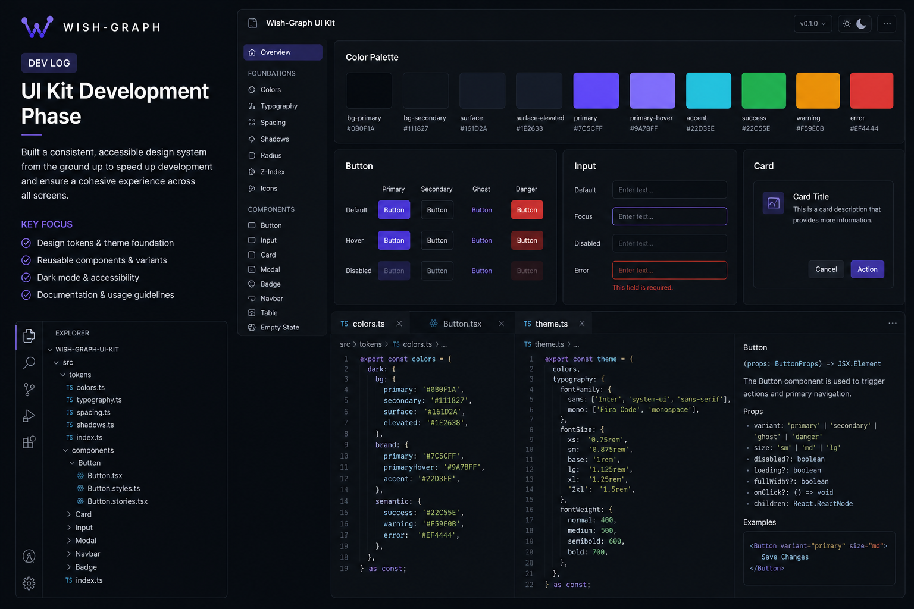

# Wish-Graph Dev Log: UI Kit Development

[Watch Dev Log Video](https://example.com/devlog-ui-kit)

Work during this phase focused on building out a dedicated UI kit to support consistent development across the application. Rather than continuing with one-off styling decisions, the goal was to define a clear design system that could be reused across screens and platforms. This included establishing a color palette, typography rules, spacing guidelines, and a baseline component structure that aligns with the overall direction of Wish-Graph.

A large portion of the effort went into creating reusable components that could scale with the application. Elements such as buttons, cards, navigation panels, and data displays were standardized, with attention given to how they behave across different layouts. This was especially important given the cross platform approach, where consistency needs to be maintained across mobile, web, and potentially other environments without duplicating effort.

By the end of this phase, the UI kit provided a stable foundation for ongoing feature development. It reduced the need to revisit design decisions repeatedly and allowed new features to be implemented more quickly. While the system will continue to evolve as the product grows, having a defined starting point has already improved both development speed and overall visual consistency.
